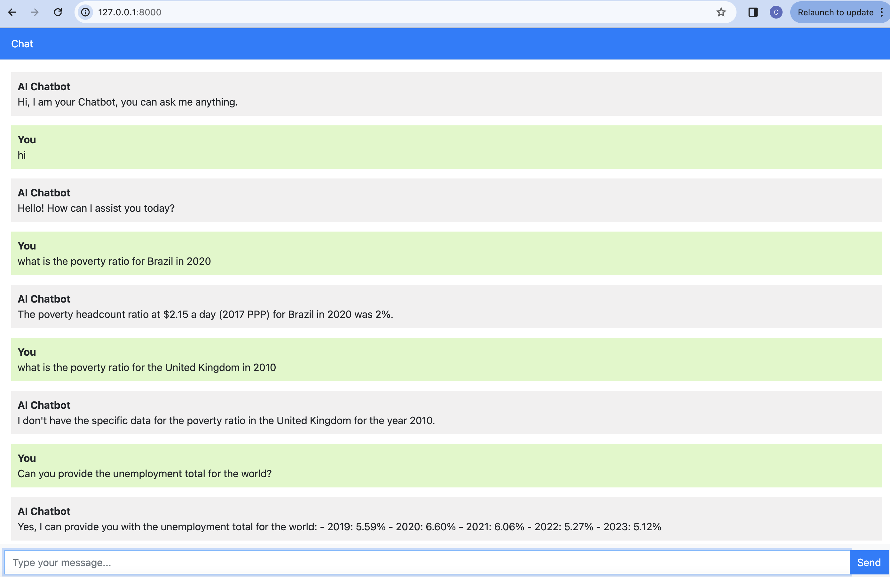

# Django_chatbot

This repository contains a Django project for building a chatbot backend integrated with a Retrieval-Augmented Generation (RAG) model and GPT 3.5. The chatbot utilizes data from three provided sources about Brazil and the Word to generate responses. It includes an API endpoint for connecting with any frontend application. 


## How to Run the Chatbot Locally

1. **Clone the repository**:
   ```bash
   git clone git@github.com:ctoanadu/Django_chatbot.git
   ```

2. **Navigate to the project directory**:
   ```bash
   cd Django_chatbot
   ```


3. **Install dependencies**:
   ```bash
   pip install -r requirements.txt
   ```

4. **Set up environment variables to hold your secret key to access Open AI GPT API**:
   - Create a `.env` file in the root directory.
   ```bash
   touch .env
   ```
5. **Set up OpenAI API key in the .env file**
   ```bash
   OPENAI_API_KEY=*****************************
   ```

6. **Start the Django development server**:
   ```bash
   python manage.py runserver
   ```
7. **User Interface**:

- Access the user interface by navigating to http://127.0.0.1:8000/ in your web browser.


## Screenshot of usage




